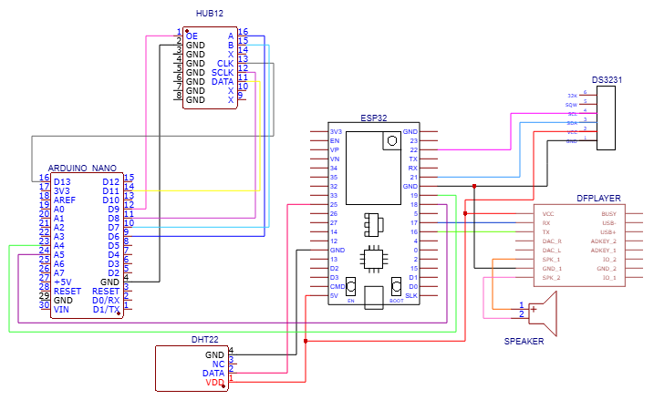
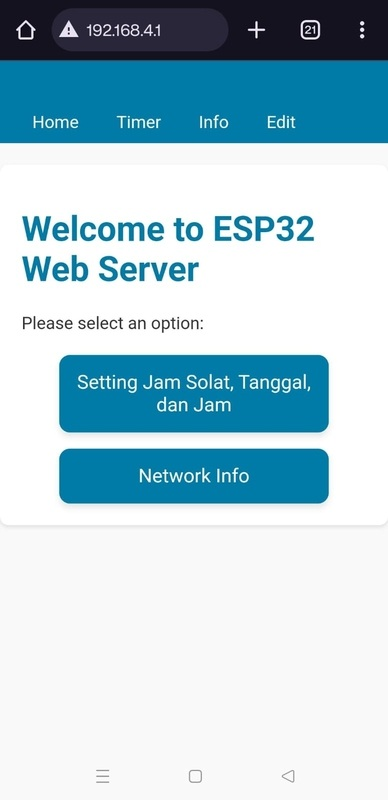
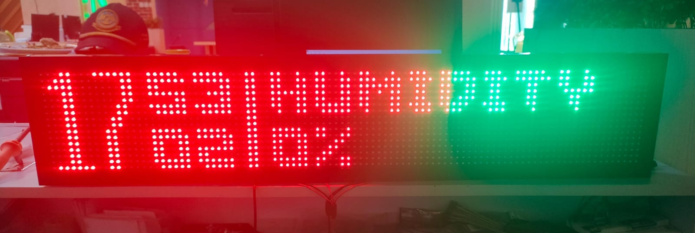

# ⏰ Digital Clock ESP32 & Arduino Nano

This project is an **IoT-based digital clock system** that displays **real-time information** such as time, temperature, humidity, and prayer schedules on a **P10 LED panel**. It features **automatic adhan audio notifications** via **DFPlayer Mini** and a **web-based user interface** for monitoring and configuration.

> 📍 Developed as part of the **Internship Program (PKL)** at **PUSDATIN - DKI Jakarta Transportation Department** by a 7th semester student of **Politeknik Negeri Jakarta** (2024).

---

## 📌 Background

The host institution lacked an integrated and accessible real-time system for displaying **time and environmental conditions** (temperature & humidity). This system was designed to provide a practical IoT solution that can be accessed via local or wireless networks.

---

## 💡 Key Features

* ⏰ Real-time display of time, date, temperature, and humidity
* 🔊 Automatic adhan audio notification at prayer times
* 🌐 Responsive web interface for control and monitoring
* 📖 Dynamic motivational quotes fetched from API
* 🔄 Communication between ESP32 and Arduino Nano via I2C

---

## 🧰 Hardware Components

* **ESP32** – Main microcontroller handling sensors, Wi-Fi, and audio
* **Arduino Nano** – Controls the P10 LED Matrix display
* **DHT22** – Temperature and humidity sensor
* **DS3231** – Real-Time Clock (RTC)
* **DFPlayer Mini + Speaker** – Plays adhan audio
* **P10 HUB12 LED Panel** – Displays clock, environmental data, and quotes

---

## 🛠️ Technologies Used

* Arduino (ESP32 and Nano C++)
* I2C and UART protocols
* HTML, CSS, JavaScript (ESP32-hosted Web UI)
* REST APIs: MyQuran Prayer Schedule, Quote API

---

## 📂 Project Structure

```plaintext
JAMDIGITALPUSDATINDISHUB/
├── ESP32/main/
│   ├── main.ino              # ESP32 setup, Wi-Fi, RTC, DHT, DFPlayer
│   ├── data.cpp/.h           # Sensor and I2C data handling
│   ├── web_display.cpp/.h    # Web UI interface
│
├── NANO/main/
│   ├── main.ino              # Main loop for P10 LED matrix
│   ├── Scene1.cpp/.h         # Clock and date display
│   ├── Scene2.cpp/.h         # Quotes display
│   ├── I2CUtils.cpp/.h       # I2C receive from ESP32
│
└── doc/
    └── diagram.png           # Schematic diagram (see below)
```

---

## 🖼️ Schematic Diagram

The schematic below illustrates the system connections between ESP32, Arduino Nano, DHT22, DS3231 RTC, DFPlayer Mini, and HUB12 LED Display Panel.



### 🔌 Pin Configuration Summary

#### ESP32:

* **GPIO 21 (SDA)** → Arduino Nano A4 (I2C)
* **GPIO 22 (SCL)** → Arduino Nano A5 (I2C)
* **GPIO 4** → DHT22 Data
* **GPIO 16 (RX2)** → DFPlayer TX
* **GPIO 17 (TX2)** → DFPlayer RX
* **3V3 / GND** → DHT22, DS3231, DFPlayer, HUB12

#### Arduino Nano:

* **A4 / A5** → I2C from ESP32
* **D6, D7, D8** → HUB12 Display (Data, CLK, etc.)
* **5V / GND** → Panel & Module Power

#### DHT22:

* **VCC** → 3.3V (ESP32)
* **DATA** → GPIO 4 (ESP32)
* **GND** → GND

#### DS3231:

* **SDA** → GPIO 21 (ESP32)
* **SCL** → GPIO 22 (ESP32)
* **VCC** → 3.3V / 5V
* **GND** → GND

#### DFPlayer Mini:

* **TX** → GPIO 16 (ESP32 RX2)
* **RX** → GPIO 17 (ESP32 TX2)
* **SPK1 / SPK2** → Speaker
* **VCC / GND** → 3.3V or 5V / GND

---

## 🌐 Web Interface

Hosted on the ESP32, accessible via `http://192.168.4.1` or local network IP.

Includes:

* Realtime clock & temperature display
* Prayer schedule (API or manual editable)
* Quotes from remote/local API
* Wi-Fi info & device status page

### 📷 Web Interface Screenshot



---

## 🚀 Real Device Preview

Below is the actual device displaying time, humidity, and other data on the P10 LED matrix panel:



---

## 🔁 System Workflow

1. **ESP32** reads:

   * Date & time from DS3231
   * Temperature & humidity from DHT22
   * Prayer schedule from MyQuran API
   * Motivational quotes from quote API
2. Sends data to **Arduino Nano** via I2C
3. **Nano** handles display on the P10 LED Matrix
4. **DFPlayer Mini** plays audio at specified prayer times
5. **User Interface** allows interaction via browser

---

## 👨‍💻 Developer

**Natanael Siwalette**
Multimedia and Network Engineering Student
Politeknik Negeri Jakarta
Focus Areas: Embedded Systems, IoT, Real-Time Web Monitoring

---

## 🚀 Live Deployment

No public hosting — local access only via ESP32.

---

## 📄 License

Open for educational, research, and prototyping use.
Feel free to fork, remix, or build upon it for non-commercial purposes.

---
